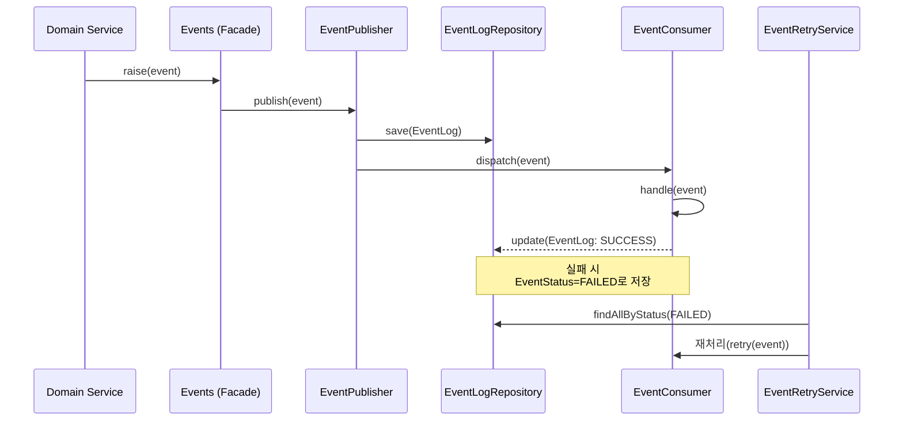

# 📘 Event 모듈 설계 문서 (TDD 기반)

## 1. 개요

이 모듈은 **도메인 이벤트(Event Driven Architecture)** 기반의 내부 비동기 통신을 담당한다.
Spring의 `ApplicationEventPublisher`를 래핑한 **글로벌 진입점(`Events`)**을 중심으로,
다양한 이벤트 발행(Publish)과 소비(Consume) 및 재처리(Retry) 로직을 분리한다.

---

## 2. 전체 구조

```
infrastructure/event/
├── domain/
│   ├── EventLog.java                # 이벤트 로그 엔티티
│   └── EventStatus.java             # 이벤트 상태 ENUM
│
├── repository/
│   └── EventLogRepository.java      # 이벤트 로그 저장소
│
├── service/
│   ├── EventPublisher.java          # 이벤트 발행기
│   ├── EventConsumer.java           # 이벤트 소비기 (핸들러)
│   └── EventRetryService.java       # 재시도 및 실패 이벤트 재처리
│
├── infrastructure/
│   └── Events.java                  # ApplicationEventPublisher 래핑 (글로벌 진입점)
│
├── config/
│   ├── EventConfig.java             # ApplicationEventPublisher Bean 설정
│   └── EventSchedulerConfig.java    # 스케줄 기반 재처리 설정
│
└── exception/
    ├── EventErrorCode.java          # 에러 코드 정의
    └── EventException.java          # 커스텀 예외
```

---

## 3. 요구사항 분석

| 구분         | 설명                             | 예시                                             |
| ---------- | ------------------------------ | ---------------------------------------------- |
| 이벤트 발행     | 특정 도메인 동작 후 이벤트를 발행한다.         | 주문 완료 시 결제 이벤트 발행                              |
| 이벤트 로그 저장  | 발행된 이벤트를 DB에 기록한다.             | EventLog 테이블에 insert                           |
| 이벤트 소비     | 등록된 리스너가 이벤트를 소비한다.            | PaymentCompletedEventConsumer.handle()         |
| 실패 이벤트 재시도 | 실패한 이벤트를 일정 주기로 재처리한다.         | RetryScheduler 통해 EventStatus = FAILED → RETRY |
| 글로벌 접근 포인트 | 서비스 레이어 어느 것에서든 이벤트를 발행할 수 있다. | `Events.raise(new PaymentEvent(...))`          |

---

## 4. 시스템 흐름도



---

## 5. 기능별 역할 및 책임

### 5.1 `domain`

* **EventLog**

    * 이벤트 메타데이🌐(이름, 페이로드, 상태, 재시도 횟수, 발생시간 등)을 관리
    * DB 영속화 대상
* **EventStatus**

    * `PENDING`, `SUCCESS`, `FAILED`, `RETRYING` 등 상태 정의

---

### 5.2 `repository`

* **EventLogRepository**

    * `JpaRepository`를 기반으로 구현
    * 주요 메서드:

        * `save(EventLog log)`
        * `findAllByStatus(EventStatus status)`
        * `updateStatus(id, newStatus)`

---

### 5.3 `service`

* **EventPublisher**

    * `Events.raise(event)` 호출 시 실제 퍼블리시 수행
    * 이벤트를 DB에 저장하고, `ApplicationEventPublisher`를 통해 전달
* **EventConsumer**

    * `@EventListener` 또는 `ApplicationListener` 기반 구현
    * 비즈니스 로직 처리 및 결과에 따른 로그 업데이트
* **EventRetryService**

    * 실패 이벤트(`FAILED`)를 스케줄러 기반으로 재시도
    * 재시도 횟수 초과 시 `DEAD_LETTER` 상태로 전환

---

### 5.4 `infrastructure`

* **Events**

    * 전역 정적 접근을 제공하는 이벤트 파사드
    * `ApplicationEventPublisher` 주입 후 `setPublisher`를 통해 초기화됨
    * 사용 예시:

      ```java
      Events.raise(new OrderCreatedEvent(orderId));
      ```

---

### 5.5 `config`

* **EventConfig**

    * `ApplicationEventPublisher` Bean 초기화 시 `Events`에 주입
* **EventSchedulerConfig**

    * `@EnableScheduling` 기반으로 `EventRetryService` 스케줄링 수행

---

### 5.6 `exception`

* **EventErrorCode**

    * `PUBLISH_FAILED`, `CONSUME_FAILED`, `RETRY_LIMIT_EXCEEDED` 등 정의
* **EventException**

    * `EventErrorCode` 기반의 커스텀 예외 처리

---

## 6. TDD 진행 전략

| 단계  | 목표               | 테스트 대상                     | 비고                                |
| --- | ---------------- | -------------------------- | --------------------------------- |
| 1단계 | EventLog 도메인 테스트 | `EventLogTest`             | 생성자, 상태변경, 재시도 증가                 |
| 2단계 | Repository 테스트   | `EventLogRepositoryTest`   | save/findAllByStatus 등            |
| 3단계 | Publisher 동작 테스트 | `EventPublisherTest`       | 이벤트 저장 + 발행 호출 검증                 |
| 4단계 | Consumer 동작 테스트  | `EventConsumerTest`        | 정상 처리/실패 케이스                      |
| 5단계 | Retry 서비스 테스트    | `EventRetryServiceTest`    | 실패 이벤트 재시도 로직                     |
| 6단계 | 통합 시나리오 테스트      | `EventFlowIntegrationTest` | raise → publish → consume → retry |
